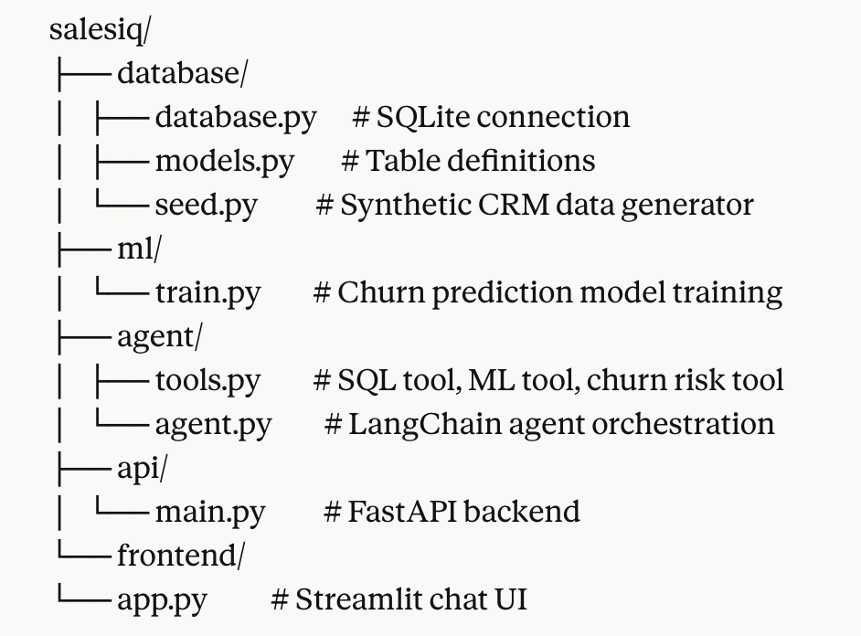

# SalesIQ — AI-Powered Sales Intelligence Assistant

A conversational AI agent that helps sales teams query business data, 
predict customer churn, and generate insights through natural language.

## Demo

Ask questions like:
- "Which customers are most at risk of churning?"
- "What is our total monthly revenue?"
- "Show me enterprise customers by spend"

## Tech Stack

| Component | Technology |
|---|---|
| AI Agent | LangChain + Claude (Anthropic) |
| LLM API | Anthropic Claude claude-haiku-4-5 |
| ML Model | scikit-learn GradientBoostingClassifier |
| Database | SQLite + SQLAlchemy |
| Backend API | FastAPI |
| Frontend | Streamlit |
| ML Tracking | MLflow |

## Project Structure



## Features

- Natural language database queries via text-to-SQL
- Customer churn prediction using ML (ROC-AUC: 0.971)
- Ranked churn risk list for all active customers
- Conversational memory across the session
- REST API with auto-generated documentation

## ML Model Performance

- Algorithm: Gradient Boosting Classifier
- Accuracy: 95%
- ROC-AUC Score: 0.971
- Top feature: total support tickets

## Setup Instructions

### 1. Clone the repository
```bash
git clone https://github.com/bhavyaanjalipotturi/salesiq.git
cd salesiq
```

### 2. Create virtual environment
```bash
python3 -m venv venv
source venv/bin/activate
```

### 3. Install dependencies
```bash
pip install -r requirements.txt
```

### 4. Add your API key
Create a `.env` file:
```env
ANTHROPIC_API_KEY=your-key-here
```

### 5. Set up database
```bash
python3 -m database.seed
```

### 6. Train the ML model
```bash
python3 -m ml.train
```

### 7. Start the API server
```bash
uvicorn api.main:app --reload --port 8000
```

### 8. Start the chat UI
```bash
streamlit run frontend/app.py
```

Open http://localhost:8501 in your browser.

## API Endpoints

| Method | Endpoint | Description |
|---|---|---|
| GET | / | Health check |
| POST | /chat | Send message to AI agent |
| GET | /health | Service status |
| GET | /docs | API documentation |

## Author

Bhavya Anjali Potturi